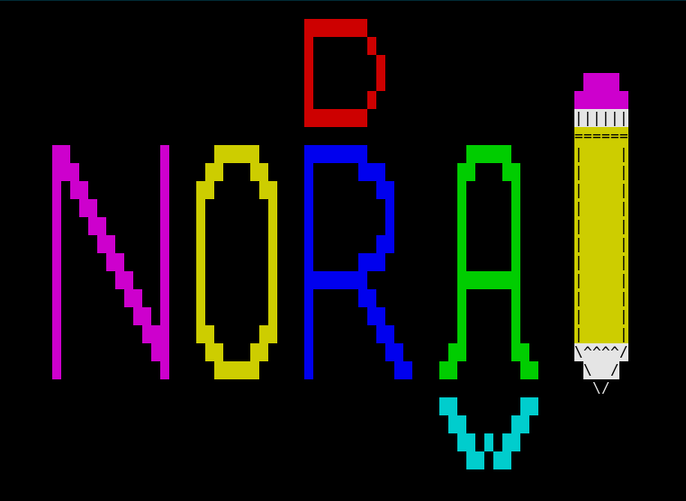

# noradraw

This is a drawing program that I wrote for my niece, Nora. It captures
some of the fun and simplicity that computers had when I was a kid.
You make drawings with eight colors and a handful of ASCII characters.



## Features

  - draw by moving the cursor (arrow keys)
  - change colors (0-7, c)
  - pick up and put down the pen (p)
  - change the pen tip (most special characters, plus some letters)
  - erase your last change (e)
  - save your drawing (s)
  - load a drawing you saved previously (l)
  - replay a drawing the way that it was drawn (r)
  - start a new drawing (n)
  - get help (h, ?)
  - quit (q)
  - drop into a Python debugger (F3)
  
No need to memorize these keys. Just play around! A helpful Owl will
tutor you as you discover new functions.

## Using

noradraw is a one file program. Clone the repository to `noradraw`, then:
```
python3 noradraw/noradraw.py
```
Make sure you run it from a curses-supported terminal, of course! 


